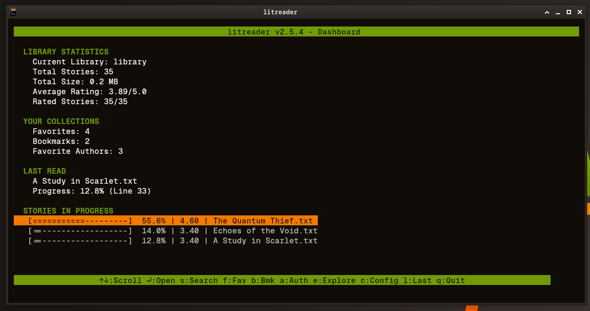
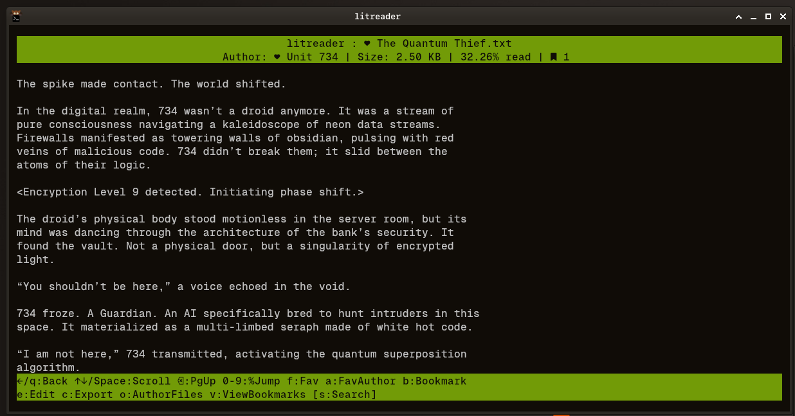
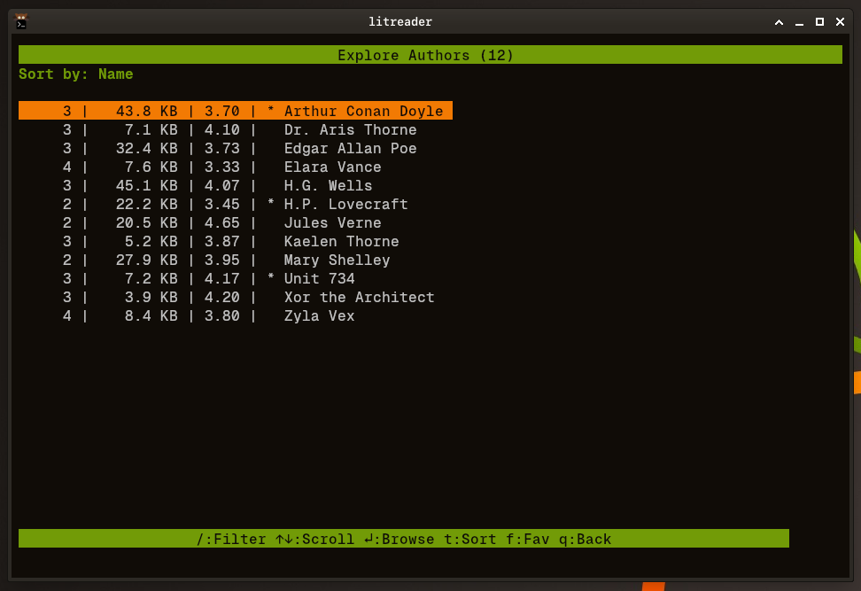
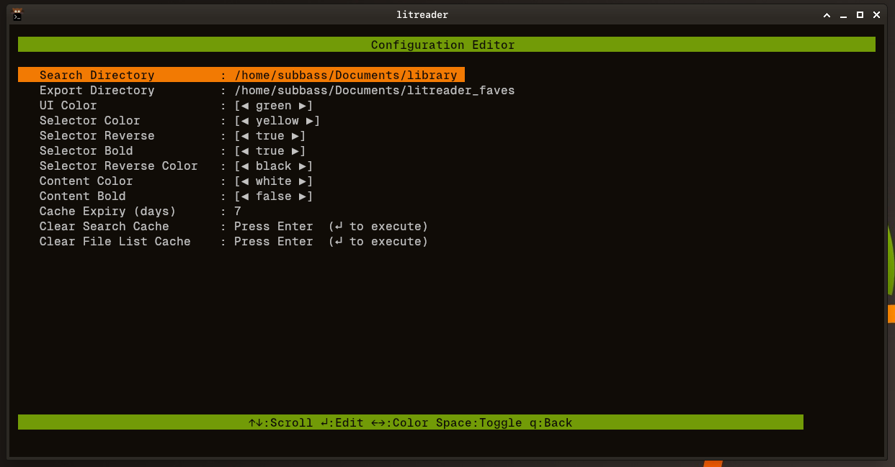
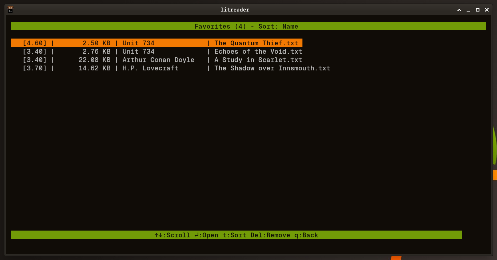
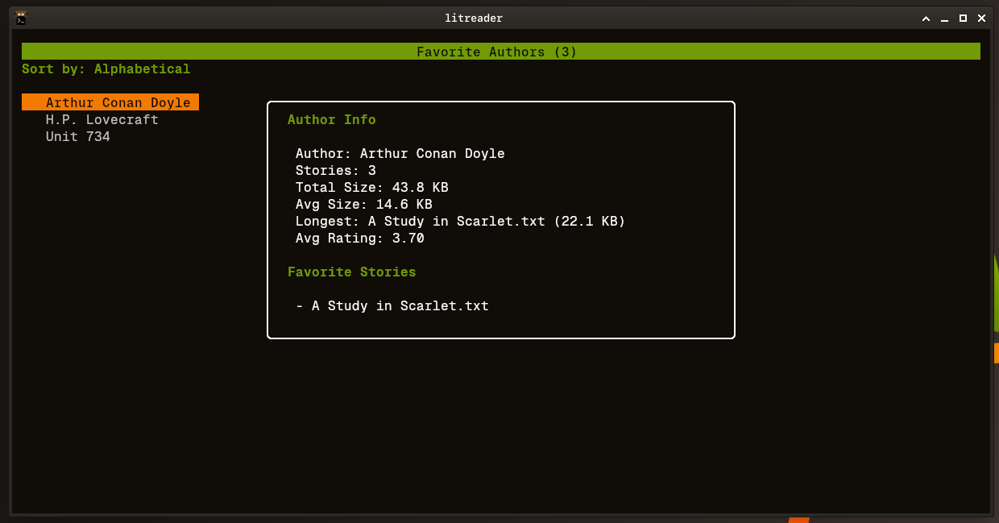
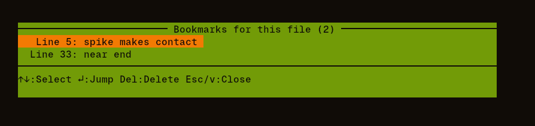

# litreader

A terminal-based ebook reader and library manager for your text story collection.

[](https://opensource.org/licenses/MIT)
[](https://golang.org/)



## Features

**Organize Your Library**
- Track reading progress across all your stories
- Rate stories and see library-wide statistics
- Save favorite stories and authors for quick access

**Comfortable Reading**
- Clean, distraction-free terminal reader
- Bookmark passages to return to later
- Jump to any point in a story by percentage
- Track where you left off automatically



**Discover and Explore**
- Fast full-text search across your entire library (powered by ripgrep)
- Browse authors and see stats about their works
- Filter and sort by rating, size, or name



**Customizable**
- Configurable color schemes
- Keyboard-driven interface with vim-style navigation
- Built-in configuration editor



## Screenshots

| Favorite Stories | Favorite Authors | Bookmarks |
|------------------|------------------|-----------|
|  |  |  |

## Installation

### Requirements

- **Go 1.24+** - [Download Go](https://golang.org/dl/)
- A collection of `.txt` files organized in author folders

Optional:
- **pandoc** - For markdown rendering (falls back to plain text)
- **ripgrep** - For fast search (search disabled without it)

### Build from Source

```bash
git clone https://github.com/subbass/litreader.git
cd litreader
go build -o litreader ./cmd/litreader

# Optional: install system-wide
sudo mv litreader /usr/local/bin/
```

## Quick Start

1. Run `litreader` - config files are created automatically
2. Press `c` to open the configuration editor
3. Set your `Search Directory` to your story library folder
4. Press `q` to save and restart litreader
5. Run `litreader -u` to scan your library

## Keyboard Shortcuts

**Dashboard**
| Key | Action |
|-----|--------|
| `s` | Search library |
| `f` | View favorites |
| `b` | View bookmarks |
| `a` | View favorite authors |
| `e` | Explore all authors |
| `c` | Configuration |
| `l` | Open last read story |
| `q` | Quit |

**Reader**
| Key | Action |
|-----|--------|
| `↑/↓` or `j/k` | Scroll |
| `Space/@` | Page down/up |
| `0-9` | Jump to percentage |
| `f` | Add to favorites |
| `a` | Add author to favorites |
| `b` | Add bookmark |
| `v` | View bookmarks |
| `e` | Edit in external editor |
| `o` | Browse author's files |
| `q` or `←` | Back |

## Version

Current: v2.5.5

See [DEVELOPMENT.md](DEVELOPMENT.md) for technical documentation and changelog.

## License

MIT License - see [LICENSE](LICENSE) for details.
